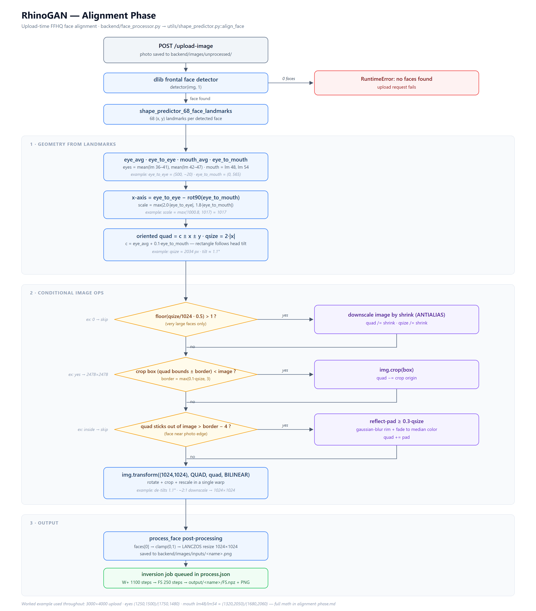
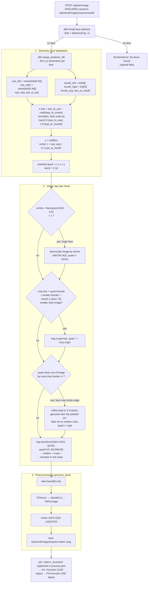

# RhinoGAN — Alignment Phase

The alignment phase turns any uploaded photo into a canonical **1024×1024 FFHQ-aligned face** so it matches the distribution StyleGAN2 (ffhq.pt) was trained on. It runs synchronously inside `POST /upload-image`, before the inversion job is queued.

Code path: `backend/main.py` → `backend/face_processor.py::process_face` → `backend/utils/shape_predictor.py::align_face` (FFHQ method, dlib 68-landmark predictor auto-downloaded to `backend/cache/`).

*(Image also available as vector: [alignment-phase.svg](./alignment-phase.svg). Mermaid source below. Simple 4-step seminar version: [alignment-phase-simple.png](./alignment-phase-simple.png).)*

## Flowchart

## Worked example

Uploaded photo: **3000×4000 px**, one face, slightly tilted. dlib landmarks give:

| Measured | Value |
|---|---|
| `eye_left` (mean of lm 36–41) | (1250, 1500) |
| `eye_right` (mean of lm 42–47) | (1750, 1480) |
| `mouth_left` (lm 48) / `mouth_right` (lm 54) | (1320, 2050) / (1680, 2060) |

**Step 1 — auxiliary vectors**

| Quantity | Formula | Result |
|---|---|---|
| `eye_avg` | (eye_left + eye_right)/2 | (1500, 1490) |
| `eye_to_eye` | eye_right − eye_left | (500, −20), norm ≈ 500.4 |
| `mouth_avg` | (mouth_left + mouth_right)/2 | (1500, 2055) |
| `eye_to_mouth` | mouth_avg − eye_avg | (0, 565), norm = 565 |

**Step 2 — oriented crop rectangle**

| Quantity | Formula | Result |
|---|---|---|
| raw `x` | eye_to_eye − flipud(eye_to_mouth)·[−1,1] | (500,−20) − (−565,0) = (1065, −20) |
| scale | max(2.0·500.4, 1.8·565) | max(1000.8, **1017**) = 1017 |
| `x` (scaled unit) | | ≈ (1016.8, −19.1) → head tilt ≈ **1.1°** |
| `y` | flipud(x)·[−1,1] | ≈ (19.1, 1016.8) |
| center `c` | eye_avg + 0.1·eye_to_mouth | (1500, 1546.5) |
| `quad` corners | c−x−y, c−x+y, c+x+y, c+x−y | (464, 549), (502, 2582), (2536, 2544), (2498, 511) |
| `qsize` | 2·\|x\| | **2034 px** |

**Step 3 — conditional image ops**

| Op | Check | This example |
|---|---|---|
| Shrink | floor(2034/1024·0.5) = 0 → not > 1 | **skipped** (only fires when qsize ≥ ~4096, i.e. very high-res faces) |
| Crop | border = max(0.1·2034, 3) = 203; box = (464−203, 511−203, 2536+203, 2583+203) = (261, 308, 2739, 2786) | **applied** → working image 2478×2478, quad shifted by (−261, −308) |
| Pad | quad now fully inside the crop (pad amounts = 0 ≤ border−4) | **skipped** (fires when the face is cut off at the photo edge; then reflect-pad + blur + fade hallucinates the missing border) |
| Transform | `img.transform((1024,1024), QUAD, quad, BILINEAR)` | maps the tilted 2034-px quad → upright 1024×1024: rotates 1.1°, crops, and rescales ~2:1 in one warp |

**Step 4 — result**

`process_face` keeps face #0, round-trips through a tensor clamp, LANCZOS-resizes to 1024×1024 and writes `backend/images/inputs/<name>.png` — eyes and mouth now sit at the fixed FFHQ positions every training image had, which is what makes the 1100-step W+ inversion converge on identity.

**Why each knob matters**

- `2.0·eye-dist vs 1.8·eye-mouth`: whichever is larger wins, so both wide faces and long faces get fully framed.
- `c = eye_avg + 0.1·eye_to_mouth`: shifts the crop center slightly below the eyes — FFHQ's canonical framing.
- Rotation comes for free: the quad is *oriented* along the eye axis, so `PIL.Image.QUAD` warping de-tilts the head without a separate rotate step.
- Reflect-pad + blur + median-fade prevents hard mirror artifacts from leaking into StyleGAN's background when the subject is near the photo border.
